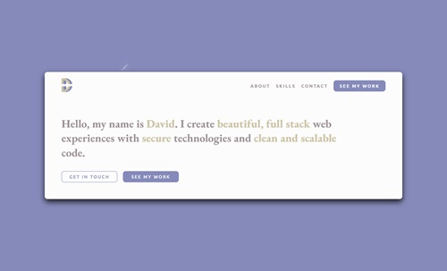

# My Portfolio Website - Mk IV

## Table of Contents

- [Overview](#overview)
- [Built With](#built-with)
- [Features](#features)
- [Contact](#contact)
- [Acknowledgements](#acknowledgements)

## Overview

<!-- TODO: Add a screenshot of the live project.
    1. Link to a 'live demo.'
    2. Describe your overall experience in a couple of sentences.
    3. List a few specific technical things that you learned or improved on.
    4. Share any other tips or guidance for others attempting this or something similar.
 -->

[Live demo.](https://davidslade.dev/)

This is the fourth version of my portfolio website. A lot of web developer portfolios sacrifice user experience for the sake of being flashy. Terminal websites, 3D experiences, scroll-jacking and annoyingly long transitions might seem cool, but as someone who was looking for inspiration many of these features simply left me feeling frustrated at the developer. I can't imagine what it's like for a client or recruiter, and as such I don't believe this is an effective way of showcasing one's work. With that said, previous iterations of my portfolio could have just as easily been done with HTML and CSS with little to no Javascript, which is quite boring in itself. I wanted to build a portfolio website that demonstrated a balance between practical design and interesting design, and this is what I came up with.

This is a single page application focused on selling the visitor a product - that product being myself. On every view the user is reminded to see my work. The design is consistent and hopefully shows some amount of planning. There is subtle animation in the background and on view transition to complement the static elements on the page. Typography is carefully curated. No technology is used without purpose - while a SPA could have been made without React, and animations could have been done without using Framer Motion, these libraries are sensible choices to complete these tasks regardless.

### Built With

<!-- TODO: List any MAJOR libraries/frameworks (e.g. React, Tailwind) with links to their homepages. -->

- [Vite](https://vitejs.dev/)
- [Framer Motion](https://github.com/thebuilder/react-intersection-observer#readme)
- [React](https://react.dev/)
- [Sass](https://sass-lang.com/)

## Contact

- [Linkedin](https://www.linkedin.com/in/david-slade-b0a90618a/)
- [My Portfolio](https://davidslade.dev/)
